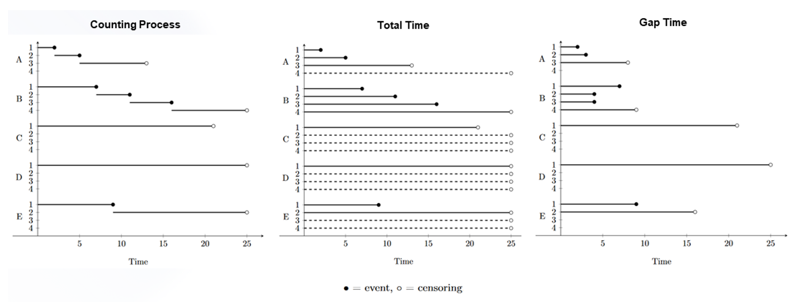

```{r, include = FALSE}
knitr::opts_chunk$set(
  collapse = TRUE,
  comment = "#>"
)
```

#### **1. Recurrent events methods**

A variety of counts and survival statistical methods, called recurrent events methods, have been developed for the correct estimation of repeated events and to take into account events occurring after the first event.

Recurrent events refer to the *repeated occurrence of the same type of event over time for the same individual*, such as hospitalizations, asthma attacks and multiple sclerosis relapses or disability progressions.
Although recurrent events can also consider terminal events (i.e. death), in MS the likelihood of terminal events is low and the interest of recurrent events methods rely on non-terminal events.

Recurrent events are characterized with five main components:

1.  **time scale** defined as calendar time (the time measured from the time origin) or gap time (time is reset to zero after each event);

2.  **risk interval** which defines when an individual is at risk of having an event along a given timescale;

3.  **risk set** or the number of individuals who are at risk at a given point in time

4.  **event-specific or common baseline hazard**

5.  the way of handling the **within-subject correlation**, which can be conditional, marginal or random effects.

The risk interval is a key concept in recurrent events that allows to define whether a model is either marginal or conditional.
It can be categorized as counting process, total time, and gap time (Figure 1).

The *counting process* uses calendar time as time scale but considers also left truncation (i.e. delayed entry).
For example, individual B is at-risk for the first event between [0, 7) and for the second, third and fourth event during [7, 11), [11, 16) and [16, 25), respectively.
An individual is not at-risk for a specific event before previous event has been observed.
*Total time* corresponds to the time from time since the beginning of the observation in the study.
For instance, individual B is at-risk for the first event in the time interval [0, 7), for the second event during [0, 11), for the third event during [0, 16) and for the fourth event during [0, 25).
On the other hand, *gap time* is the time from the prior event.
The individual B is assumed to be at risk for the first event during [0, 7) and for the second, third and fourth event during [0, 4), [0, 4) and [0, 9).

{width="100%"}

**Figure 1**.
Risk intervals illustration recurrent event data for four hypothetical individuals.

Another important concept in recurrent event methods is the type of intervention effect measure obtained.
Methods can be based on cumulative events (number of events by end of study), event rate (number of events per unit time), time to event (time to successive events) and gap time (times between successive events are accounted).
Event rate models yield a rate ratio (RR) as estimation measure (i.e. Poisson and negative binomial models), and models based on time-to-event (i.e. CoxPH) provide a hazard ratio (HR) as measure of effect.

#### **2. Multiple Sclerosis and associated clinical outcomes**

Relapses and disability progression are the main outcomes to evaluate disease progression in MS.

Disability progression is often measured by the changes in the Expanded Disability Status Scale (EDSS), which ranges from 0 to 10, with higher score indicating more severe disease.
These changes are frequent primary endpoints in clinical trials and can be derived by measuring confirmed disability progressions (CDP) during follow-up.
Relapses, are mainly measured by the Annualized Relapse Rate (ARR) in RRMS clinical trials.

#### **3. Implementation design for recurrent events.**

For the next step of model implementation, the following study design was followed in order to evaluate de effect on relapse outcomes.

{width="100%"}
